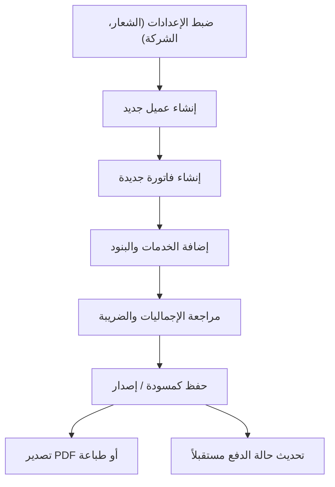

## 1. نظرة عامة على المنتج
تطبيق ويب احترافي مصمم للشركات ومقدمي الخدمات التقنية لإنشاء وإدارة وتصدير فواتير الخدمات بصيغة PDF.
- يهدف النظام إلى تسهيل عملية الفوترة للخدمات التقنية مثل الاستضافة وتطوير المواقع، مع توفير واجهة تدعم اللغة العربية (RTL) بتصميم احترافي يلائم الشركات الرسمية، ويتيح إدارة العملاء والفواتير والخدمات بكل سهولة.
- القيمة السوقية: تقديم حل متكامل ونظيف يعزز من احترافية مقدم الخدمة أمام عملائه من خلال فواتير دقيقة ومصممة بعناية.

## 2. الميزات الأساسية

### 2.1 أدوار المستخدمين
| الدور | طريقة التسجيل | الصلاحيات الأساسية |
|------|---------------------|------------------|
| مدير النظام | إعداد لمرة واحدة (مرحلة أولى بدون نظام حسابات متعدد) | إدارة الإعدادات، إنشاء وتعديل الفواتير، إدارة العملاء، إدارة الخدمات |

### 2.2 وحدات النظام الأساسية
1. **لوحة التحكم / قائمة الفواتير**: عرض الفواتير، البحث، الفلترة، وإدارة الحالات.
2. **إنشاء / تعديل فاتورة**: إدخال بيانات الفاتورة، إضافة الخدمات، حساب المجاميع.
3. **إدارة العملاء**: إضافة عملاء جدد، تعديل بياناتهم، وعرض فواتيرهم.
4. **الإعدادات**: بيانات الشركة (البائع)، الشعار، العملة الافتراضية، والشروط.
5. **معاينة وتصدير الفاتورة**: معاينة الفاتورة قبل التصدير، طباعة، وتحميل PDF.

### 2.3 تفاصيل الصفحات
| اسم الصفحة | اسم الوحدة | وصف الميزة |
|-----------|-------------|---------------------|
| قائمة الفواتير | جدول الفواتير | عرض الفواتير مع إمكانية البحث برقم الفاتورة أو العميل، وفلترة حسب الحالة والتاريخ. إمكانية نسخ، حذف، وتغيير حالة الفاتورة. |
| إنشاء فاتورة | نموذج الفاتورة | إدخال تفاصيل البائع، العميل، التواريخ، بنود الخدمات (مع إمكانية اختيار خدمة جاهزة)، وحساب تلقائي للإجماليات والضريبة والخصم. |
| إدارة العملاء | سجل العملاء | عرض قائمة العملاء، إنشاء عميل جديد، تعديل بياناته، وعرض سجل فواتيره المرتبطة. |
| الإعدادات | بيانات الشركة | رفع الشعار، تعيين بيانات الشركة، بادئة الفواتير (مثل INV-2026-)، الشروط والأحكام الافتراضية، والعملة. |
| معاينة الفاتورة | عارض الفاتورة | عرض الفاتورة بتصميم احترافي جاهز للطباعة أو التصدير كملف PDF عالي الجودة. |

## 3. العمليات الأساسية
تبدأ العملية بضبط الإعدادات، ثم إضافة العملاء (أو إضافتهم أثناء الفوترة)، يلي ذلك إنشاء فاتورة وإضافة الخدمات لها، وأخيراً حفظها ومشاركتها مع العميل.

## 4. تصميم واجهة المستخدم
### 4.1 نمط التصميم
- **الألوان الأساسية والثانوية**: استخدام ألوان احترافية (مثل الأزرق الداكن للثقة #1E3A8A، الرمادي الفاتح للخلفيات #F3F4F6، الأبيض للبطاقات).
- **نمط الأزرار**: أزرار بحواف دائرية خفيفة (Rounded-md)، مع تأثيرات Hover واضحة (تظليل أو تغيير لون).
- **الخطوط**: خطوط عربية حديثة واحترافية مثل "Cairo" أو "Tajawal" أو "IBM Plex Sans Arabic".
- **نمط التخطيط**: الاعتماد على البطاقات (Card-based) لتقسيم المعلومات (بطاقة للعميل، بطاقة للبنود، إلخ)، مع شريط تنقل جانبي أو علوي.
- **اتجاه العرض**: دعم كامل من اليمين لليسار (RTL) للغة العربية.

### 4.2 نظرة عامة على تصميم الصفحات
| اسم الصفحة | اسم الوحدة | عناصر الواجهة |
|-----------|-------------|-------------|
| نموذج الفاتورة | إدخال البنود | جداول نظيفة، حقول إدخال واضحة، نصوص توضيحية للإجماليات بخط عريض، تقسيم بصري بين بيانات العميل والشركة. |
| قائمة الفواتير | فلترة وبحث | شريط بحث علوي، قائمة منسدلة للحالة، جدول يعرض الحالات بألوان مختلفة (أخضر: مدفوعة، أصفر: مسودة، أحمر: ملغاة). |
| المعاينة/الطباعة | قالب الفاتورة | تصميم A4 نظيف، شعار في الأعلى، جدول خدمات مرتب، تفاصيل الدفع في الأسفل، بدون أي عناصر واجهة (أزرار) عند الطباعة. |

### 4.3 التجاوب
- تصميم يعتمد مبدأ (Desktop-first) نظراً لأن الاستخدام الأساسي لإدارة الفواتير يكون عبر أجهزة الكمبيوتر، مع دعم التجاوب الكامل للأجهزة المحمولة (Mobile-adaptive) وتسهيل الاستخدام باللمس.
