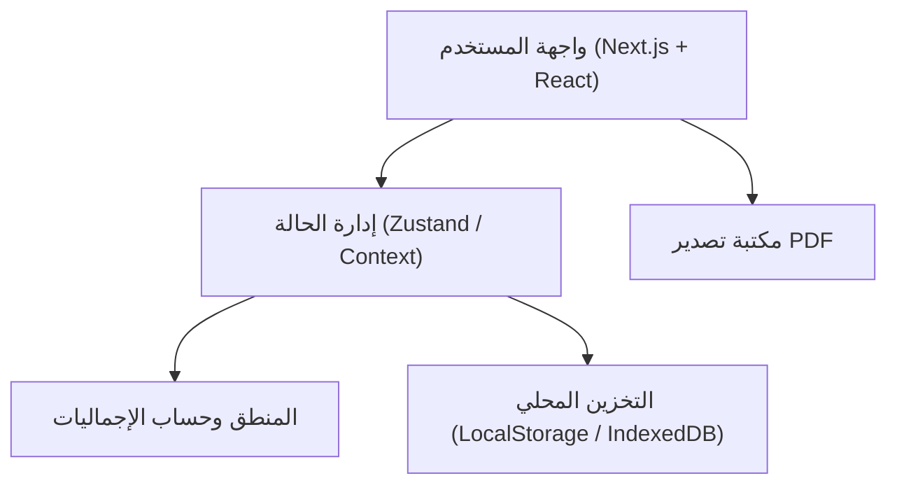
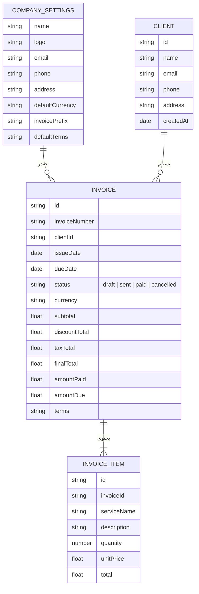

## 1. تصميم الهيكلية
يعتمد النظام على هيكلية الواجهة الأمامية المتقدمة مع إدارة الحالة محلياً أو باستخدام قواعد بيانات خفيفة/محلية تناسب بيئة المتصفح، لعدم وجود متطلبات لخادم خلفي (Backend) معقد في هذه المرحلة.

## 2. وصف التقنيات
- **الواجهة الأمامية**: Next.js (App Router) + React@18 + TypeScript
- **التصميم والتنسيق**: Tailwind CSS + دعم RTL
- **مكونات الواجهة**: Radix UI أو Shadcn UI (لبناء واجهات سريعة واحترافية)
- **إدارة الحالة والتخزين**: Zustand (لإدارة حالة الإعدادات، الفواتير، العملاء) مع Persist Middleware للحفظ في LocalStorage/IndexedDB.
- **توليد الـ PDF**: مكتبات مثل `html2canvas` + `jspdf` أو `react-to-print` للطباعة المباشرة التي تحول المتصفح لـ PDF بشكل ممتاز وبدعم للغة العربية.
- **إدارة النماذج والتحقق**: React Hook Form + Zod.
- **الخطوط**: next/font (Cairo / Tajawal).

## 3. تعريف المسارات (Routes)
| المسار | الغرض |
|-------|---------|
| `/` | لوحة التحكم وملخص سريع (أو التوجيه لقائمة الفواتير) |
| `/invoices` | قائمة الفواتير (البحث والفلترة) |
| `/invoices/create` | إنشاء فاتورة جديدة |
| `/invoices/[id]/edit` | تعديل فاتورة موجودة |
| `/invoices/[id]/preview` | معاينة وتصدير/طباعة الفاتورة |
| `/clients` | إدارة قائمة العملاء |
| `/settings` | إعدادات النظام (الشركة، الشعار، العملة) |

## 4. نموذج البيانات
سنستخدم واجهات TypeScript (Interfaces) لتمثيل البيانات المخزنة.

### 4.1 تعريف نماذج البيانات

### 4.2 البيانات الأولية (Seed Data)
- سيتم تهيئة النظام ببيانات افتراضية للشركة (مثل العملة SAR والبادئة INV-2026-).
- يمكن وضع مجموعة من "الخدمات الافتراضية" (استضافة، تطوير مواقع، الخ) في الإعدادات لتسهيل الاختيار السريع عند الفوترة.
